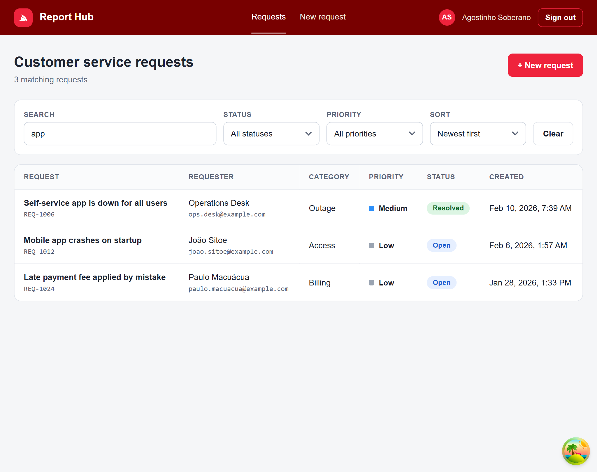
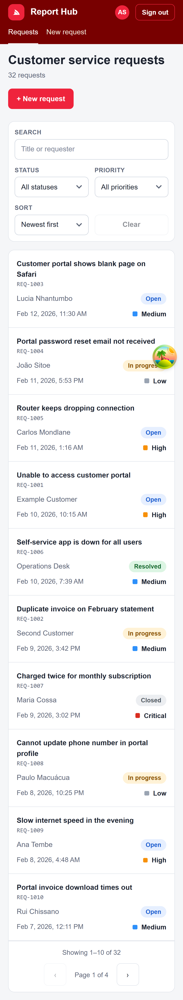
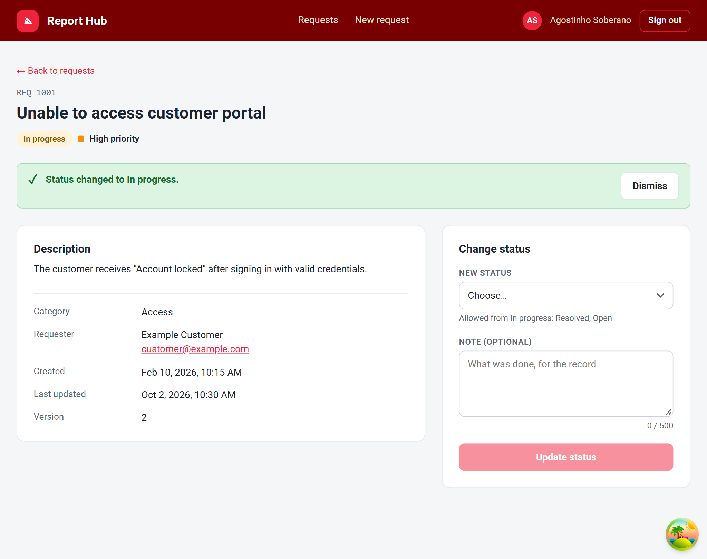
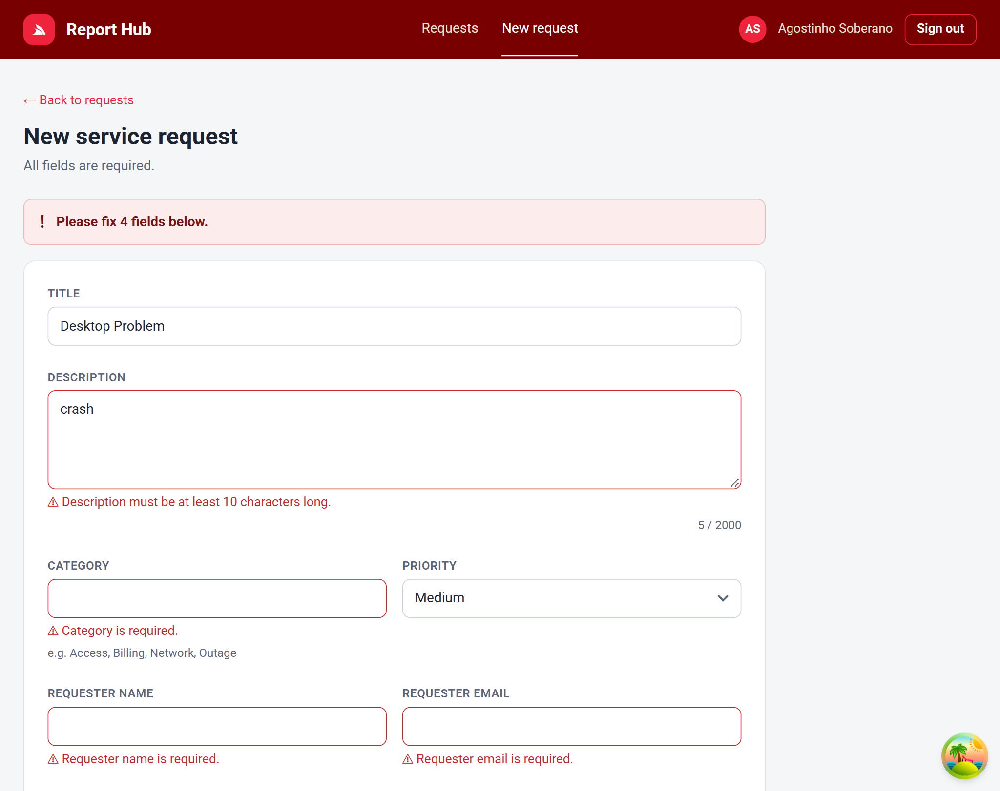
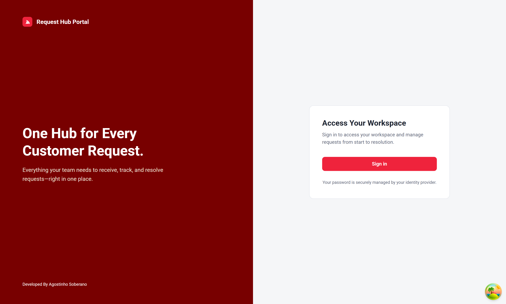

# Request Hub Portal

A responsive single-page application for managing customer service requests, built with **React 19 + TypeScript**. It consumes the Service Request API described by the provided **OpenAPI 3** file (`openapi/service-requests.yaml`). Users sign in through an external **OpenID Connect** provider (Keycloak locally).



## Contents

1. [Solution overview](#1-solution-overview)
2. [Technology and library choices](#2-technology-and-library-choices)
3. [Architecture summary](#3-architecture-summary)
4. [Local setup](#4-local-setup)
5. [OIDC provider configuration](#5-oidc-provider-configuration)
6. [Environment variables](#6-environment-variables)
7. [API mocking approach](#7-api-mocking-approach)
8. [Commands](#8-commands)
9. [Testing strategy](#9-testing-strategy)
10. [GitHub Actions workflow](#10-github-actions-workflow)
11. [Security and accessibility](#11-security-and-accessibility)
12. [Known limitations](#12-known-limitations)

---

## 1. Solution overview

Signed-in users can:

| Requirement                                                               | Where                         |
| ------------------------------------------------------------------------- | ----------------------------- |
| Sign in and sign out through an OIDC provider (Authorization Code + PKCE) | `/login`, header **Sign out** |
| Paginated list of service requests                                        | `/requests`                   |
| Search by title or requester (debounced)                                  | list → Search                 |
| Filter by status and priority                                             | list → Status / Priority      |
| Sort by creation date (newest / oldest)                                   | list → Sort                   |
| Request details                                                           | `/requests/:id`               |
| Create a request (with validation)                                        | `/requests/new`               |
| Update the status (only allowed transitions, optimistic concurrency)      | detail → Change status        |
| Loading, empty, validation, authentication and API error states           | every page                    |

All list state (search, filters, sort, page) lives in the URL, so refresh, the Back button and shared links work. The layout adapts from desktop to phone: the table becomes cards and the forms become one column.

|                                                       |                                                   |
| ----------------------------------------------------- | ------------------------------------------------- |
|     |  |
|  |             |

## 2. Technology and library choices

| Concern               | Choice                                            | Why                                                                                                                    |
| --------------------- | ------------------------------------------------- | ---------------------------------------------------------------------------------------------------------------------- |
| Build / dev server    | **Vite 8**                                        | Fast dev server, simple config, first-class TypeScript                                                                 |
| UI                    | **React 19**, **TypeScript 5.9** (strict)         | Required by the brief. Strict mode catches mistakes at compile time                                                    |
| Routing               | **React Router 7**                                | The standard client-side router. Nested routes give one layout and one auth guard                                      |
| Server state          | **TanStack Query 5**                              | Caching, request cancellation, retries and cache invalidation without hand-written `useEffect` code                    |
| API types             | **openapi-typescript**                            | Generates `src/api/schema.d.ts` from the OpenAPI file, so the contract and the code can't drift apart (CI checks this) |
| Forms / validation    | **react-hook-form** + **zod**                     | One schema mirrors the contract's rules. Little re-rendering. The server's 422 errors land on the same fields          |
| OIDC                  | **react-oidc-context** on **oidc-client-ts**      | Certified OIDC library: PKCE, state checks, token exchange and silent renewal are not hand-written                     |
| OIDC provider (local) | **Keycloak 26** in Docker                         | A reviewer gets a working provider with `docker compose up`, with no account to create                                 |
| API mocking           | **MSW 3**                                         | The same fake backend in the browser (development) and in Node (tests)                                                 |
| Styling               | **CSS Modules** + design tokens (CSS variables)   | No runtime cost, scoped class names, no UI framework to learn. Responsive with CSS Grid and media queries              |
| Tests                 | **Vitest 5**, **Testing Library**, **jsdom**, MSW | Same config as Vite. Tests use the app the way a user does                                                             |
| Lint                  | **oxlint**                                        | Fast, with React hooks rules                                                                                           |
| Icons                 | **react-icons**                                   | One package with many icon sets as React components. Only the icons that are imported end up in the bundle             |

## 3. Architecture summary

```
src/
  api/              The only code that talks HTTP
    schema.d.ts       generated from openapi/service-requests.yaml (never edited by hand)
    types.ts          friendly names for the generated types + enum arrays
    client.ts         apiFetch: base URL, Bearer token, query string, JSON, errors -> ApiError
    ApiError.ts       one error type: status, title, detail, traceId, fieldErrors
    requests.ts       one function per endpoint (list, get, create, update status)
  auth/             Sign-in
    session.ts        the Session shape + useSession()
    OidcSessionProvider.tsx / MockSessionProvider.tsx   real OIDC / demo user
    ProtectedRoute.tsx, AuthCallbackPage.tsx, LoginPage.tsx
  features/requests/ Everything about service requests
    queries.ts        TanStack Query hooks (useRequests, useRequest, useCreateRequest, useUpdateRequestStatus)
    *Page.tsx         list, detail, create
    listFilters.ts    URL <-> filters <-> API params
    transitions.ts    allowed status changes (from the contract)
    createRequestSchema.ts  form rules (from the contract)
  components/       Reusable UI: Button, Card, ErrorMessage, FormField, Spinner, Layout...
  mocks/            MSW fake backend (handlers, in-memory db, seed data)
  test/             Test setup and the renderApp() helper
```

**The data path:** a component never calls `fetch`. It calls a hook, the hook calls an API function, and `apiFetch` is the only place that knows URLs, tokens and error formats.

```
Page ──▶ queries.ts (cache, retries, invalidation) ──▶ requests.ts ──▶ apiFetch ──▶ API (or MSW)
```

Key decisions:

- **Contract first.** The types are generated from the OpenAPI file. Enum values, status transitions and validation limits come from it too.
- **One error type.** Every failure (Problem Details, non-JSON error page, no network) becomes an `ApiError`, so pages can check `error.isNotFound`, `error.isConflict` or `error.fieldErrors.title`.
- **Optimistic concurrency.** A status change sends the `version` the user last saw. On **409** the app explains that someone else changed the request and reloads the latest version.
- **Swappable sign-in.** Pages only use `useSession()`. The real OIDC provider and the demo user are two implementations of the same interface. `apiFetch` gets its token and its "401 happened" handler injected, so it doesn't depend on React or on the OIDC library.

## 4. Local setup

Requirements: **Node.js 22.12+** (see `.nvmrc`), **npm**, and **Docker** for the local Keycloak.

```bash
git clone <this repository>
cd request-hub
npm install

docker compose up        # terminal 1: Keycloak on http://localhost:8080 (ready after ~20 s)
npm run dev              # terminal 2: the app on http://localhost:5173
```

Sign in as **`agostinhosoberano`** / **`demo1234`**. This test user exists only in the local Keycloak container.

**Without Docker:** create `.env.development.local` containing `VITE_OIDC_AUTHORITY=` (empty) and restart `npm run dev`. The app then signs you in as a demo user, and the login page says so.

Development-only pages: `/dev/ui-kit` (all components) and `/dev/api` (call every endpoint and see the raw answers).

## 5. OIDC provider configuration

The app is a **public client** using the **Authorization Code flow with PKCE (S256)**. There is no client secret anywhere in the frontend.

### Local Keycloak (included)

`docker compose up` starts Keycloak 26.4 and imports `keycloak/request-hub-realm.json`:

| Setting                   | Value                                                             |
| ------------------------- | ----------------------------------------------------------------- |
| Realm                     | `request-hub`                                                     |
| Client ID                 | `request-hub-rh` (public, standard flow only, PKCE S256 required) |
| Valid redirect URIs       | `http://localhost:5173/*`                                         |
| Post-logout redirect URIs | `http://localhost:5173/*`                                         |
| Web origins (CORS)        | `http://localhost:5173`                                           |
| Access token lifetime     | 5 minutes (renewed automatically with the refresh token)          |
| Test user                 | `agostinhosoberano` / `demo1234`                                  |

Admin console: http://localhost:8080/admin (`admin` / `admin`, local container only).

### Any other OIDC provider (Auth0, Entra ID, Okta...)

Register a **single-page / public** application with:

- Grant type **Authorization Code** with **PKCE**, no client secret
- Allowed callback URL: `http://localhost:5173/auth/callback`
- Allowed logout URL: `http://localhost:5173/login`
- Allowed web origin: `http://localhost:5173`

Then set `VITE_OIDC_AUTHORITY` (the issuer URL) and `VITE_OIDC_CLIENT_ID`. Some providers (e.g. Auth0) only issue an API access token when an _audience_ is requested. That needs one extra setting in `src/auth/oidcConfig.ts`.

### How sign-in works

1. **Sign in** redirects to the provider with a PKCE (a hash of a one-time secret) .
2. The user enters their password **on the provider's page**. The app never sees it.
3. The provider redirects to `/auth/callback?code=…`.
4. The library exchanges the code and the PKCE verifier for tokens.
5. `apiFetch` sends `Authorization: Bearer <access token>` on every API call.

Note: the OpenAPI file documents 401/403 responses but defines no `securityScheme`. The app sends the access token as a standard Bearer token.

## 6. Environment variables

Only `VITE_*` variables reach the browser, and they are **public** (visible in the built JavaScript), so none of them is a secret. Documented in `.env.example`.

| Variable                 | Example                                    | Purpose                                                                    |
| ------------------------ | ------------------------------------------ | -------------------------------------------------------------------------- |
| `VITE_API_BASE_URL`      | `/api`                                     | Base URL of the Service Request API                                        |
| `VITE_ENABLE_MOCKS`      | `true`                                     | `true` starts the MSW fake backend in the browser                          |
| `VITE_OIDC_AUTHORITY`    | `http://localhost:8080/realms/request-hub` | OIDC issuer. Empty + mocks on = demo user                                  |
| `VITE_OIDC_CLIENT_ID`    | `request-hub-spa`                          | Public client ID                                                           |
| `VITE_OIDC_REDIRECT_URI` | `http://localhost:5173/auth/callback`      | Where the provider sends the user back (default: `<origin>/auth/callback`) |
| `VITE_OIDC_SCOPE`        | `openid profile email`                     | Optional, this is the default                                              |

Files: `.env.example` (template), `.env.development` (defaults for `npm run dev`), `.env.test` (used by `npm test`). Personal overrides go in `*.local` files, which are git-ignored.

## 7. API mocking approach

There is no real backend, so **MSW (Mock Service Worker)** plays the API from the contract:

- **In the browser** (`npm run dev`, `VITE_ENABLE_MOCKS=true`), a service worker answers `/api/...` calls. You can see them in the Network tab like real requests.
- **In tests**, the same handlers run in Node (`msw/node`).

The fake backend is not a stub. It follows the contract, including the error cases:

- 32 seed requests in an in-memory database, which resets on page refresh.
- Search, status and priority filters, sorting, pagination.
- **400** for invalid query parameters, **404** for unknown ids.
- **422** for invalid fields or a forbidden status transition, with `errors` per field.
- **409** when the `version` sent is not the current one.
- **401** without a Bearer token.
- Errors use **Problem Details** (`application/problem+json`) with a `traceId`.

To point the app at a real API, set `VITE_ENABLE_MOCKS=false` and `VITE_API_BASE_URL` to the API's URL.

## 8. Commands

| Command                      | What it does                                           |
| ---------------------------- | ------------------------------------------------------ |
| `npm run dev`                | Start the dev server on http://localhost:5173          |
| `npm run lint`               | Lint with oxlint                                       |
| `npm run typecheck`          | Type-check the whole project (app and tests)           |
| `npm test`                   | Run all tests once (Vitest)                            |
| `npm run test:watch`         | Run the tests on every file change                     |
| `npm run build`              | Type-check and build for production into `dist/`       |
| `npm run preview`            | Serve the production build locally                     |
| `npm run generate:api`       | Regenerate `src/api/schema.d.ts` from the OpenAPI file |
| `docker compose up` / `down` | Start / stop the local Keycloak                        |

## 9. Testing strategy

**40 tests** in 9 files, run with Vitest and Testing Library in jsdom (`npm test`). The goal is a few meaningful tests of what would break the user's work, not a coverage percentage.

**Unit tests** cover the plain functions where the rules live:

| File                          | What it checks                                                                                                      |
| ----------------------------- | ------------------------------------------------------------------------------------------------------------------- |
| `transitions.test.ts`         | Allowed status changes; CLOSED is final                                                                             |
| `listFilters.test.ts`         | URL ↔ filters; junk in the URL falls back to defaults; no empty search sent                                         |
| `pageItems.test.ts`           | Page buttons with gaps                                                                                              |
| `createRequestSchema.test.ts` | Required fields, length limits, email, priority, trimming                                                           |
| `client.test.ts`              | Bearer header; Problem Details → `ApiError`; 422 field errors; no network (status 0); non-JSON 502; the 401 handler |

**Integration tests** render the **whole app** at a URL (`src/test/renderApp.tsx`), with real routes, pages and hooks, against the MSW fake backend:

| File                         | Scenarios                                                                                                                                         |
| ---------------------------- | ------------------------------------------------------------------------------------------------------------------------------------------------- |
| `RequestListPage.test.tsx`   | First page; search; status filter; empty state + Clear filters; 500 error + Try again                                                             |
| `RequestDetailPage.test.tsx` | Only allowed statuses offered, change saved; **409 conflict**; Closed request; 404                                                                |
| `CreateRequestPage.test.tsx` | Client validation (nothing sent, focus, `aria-invalid`, accessible description); **server 422 on the right field**; success opens the new request |
| `auth.test.tsx`              | Signed out → login → back to the wanted page; sign out; **401** → "session expired"; **403** → "no permission"                                    |

Choices:

- **Tests find elements the way users do:** by role, label and visible text, never by CSS class. This also checks accessibility. For example, the create test asserts what a screen reader announces for an invalid field.
- **Error cases are tested by overriding one handler** (`server.use(...)`) for that test only.
- **Each test starts clean:** the fake database is reset, handler overrides are removed, and storage is cleared after every test.
- **No Keycloak in tests.** They use the demo session, which has the same `Session` interface as the real provider.
- The tests were checked against deliberately broken code: allowing CLOSED → OPEN, ignoring a 409, and sending empty query values each made the matching test fail.

The real sign-in flow against Keycloak, the layouts on phone and desktop, and keyboard navigation were checked by hand in a browser during development. They are not automated (see Known limitations).

## 10. GitHub Actions workflow

`.github/workflows/ci.yml` runs on every push to `main` and on every pull request:

1. Check out the code. Set up Node from `.nvmrc`, with the npm cache.
2. `npm ci`: installs exactly what `package-lock.json` says.
3. **Contract check:** regenerate the API types and fail if `src/api/schema.d.ts` differs. The committed types must match the OpenAPI file.
4. `npm run lint`
5. `npm run typecheck`
6. `npm test`
7. `npm run build`
8. Upload `dist/` as a build artifact (kept 7 days).

It runs with read-only permissions, and a newer push to the same branch cancels the older run.

## 11. Security and accessibility

### Security

- **Authorization Code + PKCE** with a public client. There is no client secret in the frontend, and a stolen authorization code is useless without the PKCE verifier.
- **Tokens are handled by the OIDC library**, in `sessionStorage` (cleared when the tab closes), never in `localStorage` and never logged. Access tokens are short-lived (5 min) and renewed quietly with the refresh token.
- The **token is only sent to the configured API** (`apiFetch` only calls `VITE_API_BASE_URL`).
- **401 → sign in again; 403 → "you don't have permission".** The difference matters: signing in again can't fix a missing permission.
- **Sign out clears the query cache** and ends the provider session, so the next person on the computer sees nothing.
- **Route guards are for the user experience.** The real protection is the API rejecting requests without a valid token.
- **No HTML injection.** User text (e.g. descriptions) is rendered as text by React, and `dangerouslySetInnerHTML` is never used.
- **Validation in the browser is for convenience.** The server is the authority, so its 422 errors are always handled.
- No secrets in the repository. `VITE_*` values are public by design.
- The local Keycloak `admin/admin` and the test user are for development only.

### Accessibility

- **Semantic HTML:** real `<button>`, `<a>`, `<table>` (with caption and `scope`), `<dl>`, `<time>`, `<label>`. Native `<select>` elements are styled with CSS, so keyboard and screen-reader support stays intact.
- **Forms:** every control has a label. Errors and hints are linked with `aria-describedby`, invalid fields get `aria-invalid` (the red border is styled from it), focus moves to the first error, and a summary uses `role="alert"`.
- **Announcements:** loading uses `role="status"`, errors use `role="alert"`, and a hidden live region announces "N matching requests" after a search.
- **Keyboard:** "Skip to main content" link, visible `:focus-visible` outline, and table rows that are real links (Tab + Enter).
- **Responsive:** one table that turns into cards on phones, 44 px touch targets for pagination, no sideways scrolling at 390 px.
- `prefers-reduced-motion` is respected.

## 12. Known limitations

- **No real backend.** The API is mocked with MSW. Its data lives in the browser tab and resets on refresh.
- **No deployment.** CI builds and uploads `dist/`, but nothing is published (e.g. to GitHub Pages). A hosted demo would also need the provider to allow its URL.
- **No automated end-to-end tests.** The Keycloak sign-in flow was verified manually in a browser (Playwright scripts during development), not in CI.
- **Scopes and roles are not used.** The app doesn't request API scopes (e.g. `service-requests.write`) or hide actions by role. A 403 is handled when it happens.
- **Tokens in `sessionStorage`** are readable by JavaScript on the page. A backend-for-frontend with HTTP-only cookies would be stronger, but needs a server.
- **Sorting** is offered by creation date only (as the brief asks), although the API also supports `updatedAt` and `priority`.
- **English only.** Dates are formatted in the user's locale and time zone.
- **Keycloak runs in dev mode** with its built-in database. Changes made in its admin console are lost after `docker compose down`.
